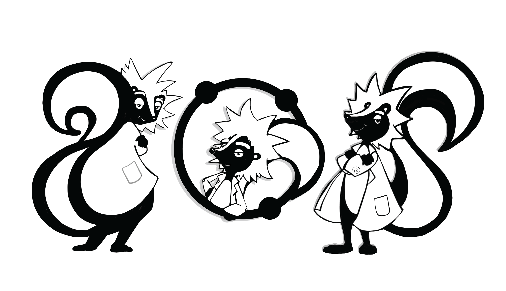
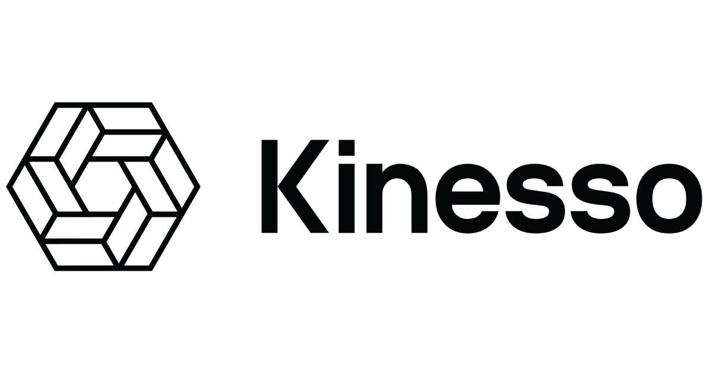

 

# Skunks Reinforcement Learning Challenge 2020

## Introduction:

Learning to act optimally on time series data is of practical use in various industries. The value of taking an action depends on future actions and states, which makes it difficult to be modeled using conventional machine learning techniques. This is where reinforcement learning comes in the picture. In this challenge, you will be working on multivariate time series data. To get started on the challenge, begin by finding a multivariate time series dataset whose dependent/target variable is a real number and has finite action choices/actions. In this challenge, you will build an open-gym ai (openAI gym) environment for that dataset to be able to run for an RL algorithm. You are encouraged to run any of the following TF-agent algorithms - DQN, REINFORCE, DDPG, TD3, PPO, or SAC on it. Please go through step by step implementation guide to meet the requirements of the challenge.


Currently the following algorithms are available under TF-Agents:

*   [DQN: __Human level control through deep reinforcement learning__ Mnih et
    al., 2015](https://deepmind.com/research/dqn/)
*   [DDPG: __Continuous control with deep reinforcement learning__ Lillicrap et
    al., 2015](https://arxiv.org/abs/1509.02971)
*   [TD3: __Addressing Function Approximation Error in Actor-Critic Methods__
    Fujimoto et al., 2018](https://arxiv.org/abs/1802.09477)
*   [REINFORCE: __Simple Statistical Gradient-Following Algorithms for
    Connectionist Reinforcement Learning__ Williams,
    1992](http://www-anw.cs.umass.edu/~barto/courses/cs687/williams92simple.pdf)
*   [PPO: __Proximal Policy Optimization Algorithms__ Schulman et al., 2017](https://arxiv.org/abs/1707.06347)
*   [SAC: __Soft Actor Critic__ Haarnoja et al., 2018](https://arxiv.org/abs/1812.05905)

## Eligibility:  
The challenge is open to the current Northeastern University Graduate students. The purpose of this challenge is to pre-screen candidates for three 15 hours per week Programmer-Analyst positions for the coming Fall semester.   

The position may involve signing an NDA and data usage agreement with Kinesso as its objective is to apply state of the art reinforcement techniques to ad optimization.  

We sincerely appreciate your interest and hope to see you participate in this challenge!!


## Implementation Guide
Please incorporate the below guidelines in your solution: 

- Find and Load the time series data 
    - Dataset: Stock Price or Bitcoin Dataset
    - Dataset can be univariate or a multi-variate dataset  
    - The dependent variable must be a real number with defined action choices
              
- Create and modify your own open-gym ai environment for the dataset
    - See the class Env https://github.com/openai/gym/blob/master/gym/core.py
    
```python    
class Env(object):
    """The main OpenAI Gym class. It encapsulates an environment with
    arbitrary behind-the-scenes dynamics. An environment can be
    partially or fully observed.
    The main API methods that users of this class need to know are:
        step
        reset
        render
        close
        seed
```        
     - Look at the example open-gym ai environments          

- Run one of the TF-Agents algorithms in the environment
    - You can select one of these RL algorithms of your choice and run them in the environment created 
    - RL Algorithms: DQN, REINFORCE, DDPG, TD3, PPO or SAC
    
- Compare the RL learner performance with any of the following:
    - A random action agent vs Simple agents like Thompson sampling, e-greedy, or UBC
    - Compare and plot the difference in the performance

- Describe the signals and action space for the TF-Agents algorithms and include points such as:
    - Can they take continuous or only discrete signals? 
    - Can the agent only be used in any environment which has a discrete action space?

- Write about the pros and cons of the TF-Agents algorithms


## Additional Resources:
- Comparision of RL learner algorithms: https://towardsdatascience.com/solving-multiarmed-bandits-a-comparison-of-epsilon-greedy-and-thompson-sampling-d97167ca9a50
- Trading with RL: https://medium.com/ether-labs/tradebot-stock-trading-using-reinforcement-learning-part1-8b67c9603f33
- Custom gym environment: https://medium.com/@apoddar573/making-your-own-custom-environment-in-gym-c3b65ff8cdaa
- https://stackoverflow.com/questions/45068568/how-to-create-a-new-gym-environment-in-openai
- Reinforcement Learning - Thompson Sampling & the Multi-Armed Bandit Problem https://colab.research.google.com/drive/1gdR7k7jtSRqYnPNHcbAKdIjGRjQXpfnA  
- Andre Cianflone - Thompson sampling https://colab.research.google.com/drive/1BHVH712x2Q2As9E5nN5Y8UR74T8w6AMO  


## Your submission:
The jupyter notebook should include a detailed analysis and conclusion.  
Please submit the notebook and any other code you wrote into a zipped folder and e-mail to "ni.brown@neu.edu".

### Thank You!

The Skunks Reinforcement Learning Challenge 2020 is made possible by a generous grant from Kinesso.   

 

Kinesso, the Marketing Engine of IPG, is focused on creating data-driven solutions through enhanced or newly-created products and services, maximizing the impact of traditional and addressable media. Kinesso’s core principle is to drive smarter business decisions and better outcomes for clients using our suite of data and technology services.


